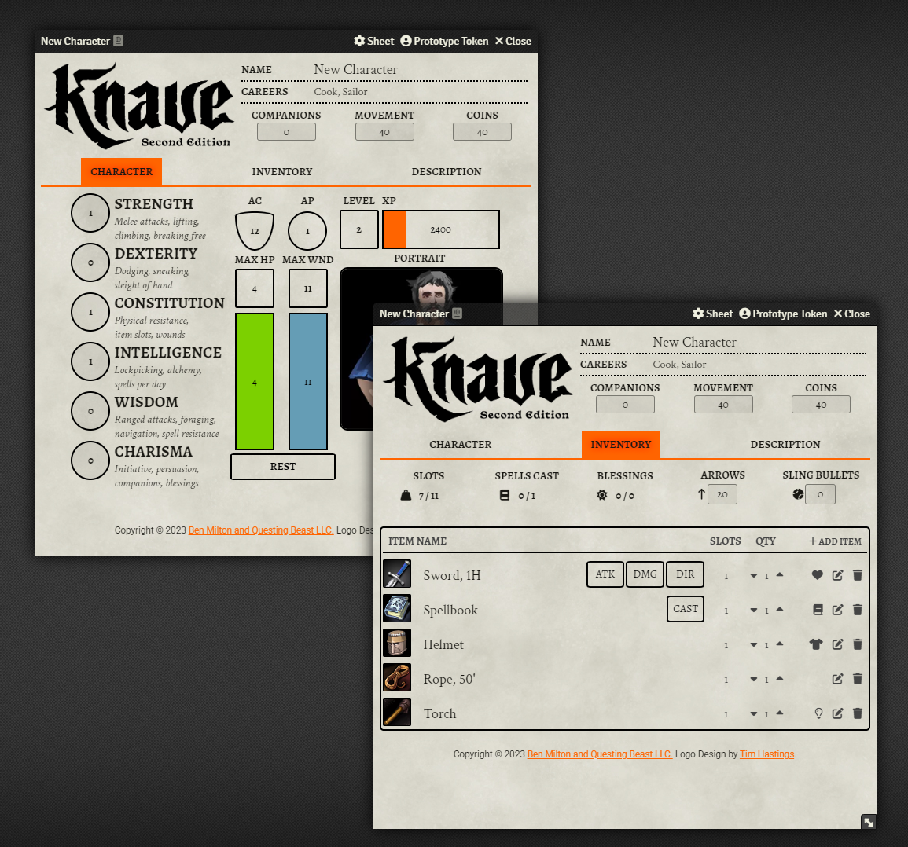

# Knave Second Edition (Unofficial) - Game System for Foundry Virtual Tabletop


This game system for [Foundry Virtual Tabletop](https://foundryvtt.com/) provides character sheets and rule automation for [Knave Second Edition](https://www.kickstarter.com/projects/questingbeast/knave-rpg-second-edition) by [Ben Milton and Questing Beast LLC](https://questingbeast.substack.com/). 



Knave Second Edition for FoundryVTT is an independent production of Lee Talman and is not affiliated with Questing Beast LLC. 

## Automatic Installation
Knave Second Edition for FoundryVTT is now available to download from Foundry's [official game system](https://foundryvtt.com/packages/knave2e) list!

## Manual Installation
1. In your Foundry UI, select "Install System" under "Game Systems".
2. Copy and paste the following link into the "Manifest URL field", then click "Install":
`https://raw.githubusercontent.com/Lee-Talman/knave2e/main/system.json`


## Features
Knave Second Edition for FoundryVTT provides sheets for player characters, monster, recruits (hireling, mercenaries, and experts), and items (weapons, armor, light sources, spellbooks, and general equipment). The game system provides the following automations, with optional to disable most of them:

### Characters:
- [x] Character ability scores determine slots, wounds, spells per day, *etc*.
- [x] Character level automatically adjusts based on XP
- [x] Automatically restore HP (and/or Wounds) depending on type of rest
- [x] Active Relics and Companions cannot exceed CHA

### Combat:
- [x] Roll attack, damage, and direct damage from the sheet or chat buttons
- [x] Add weapon attack/damage bonuses and set custom damage dice per weapon
- [x] Weapons break on a natural 1, or after using a power attack
- [x] Roll number appearing for each monster in either dungeon or wilderness
- [x] Maneuver reminder trigger on rolls >= 21
- [x] Monsters roll with level, half-level, or 0
- [x] Roll morale checks for both monsters & recruits
- [x] Spellbooks can only be cast once per rest

### Slots & Items:
- [x] Character's maximum slots reduces upon receiving wounds
- [x] Coins and ammo auto-calculate their slot value 
- [x] Items in wounded/overencumbered slots cannot be used
- [x] Items can be dragged between sheets, and will automatically stack
- [x] Light sources can be customized and turned on/off from the sheet*

*requires Token Vision enabled on the Scene

## Custom Levels & XP
`knave2e` supports custom level XP, levels beyond 1-10, and custom level labels. These are defined as a single JSON structure:

```json
{
    "1": {
        "xp": 0,
        "label": "Wretch"
    },
    "2": {
        "xp": 2000,
        "label": "Lowlife"
    },
    "3": {
        "xp": 4000,
        "label": "Hoodlum"
    },
    "4": {
        "xp": 8000,
        "label": "Fool"
    },
    "5": {
        "xp": 16000,
        "label": "Dastard"
    },
    "6": {
        "xp": 32000,
        "label": "Cad"
    },
    "7": {
        "xp": 640000,
        "label": "Gadabout"
    },
    "8": {
        "xp": 125000,
        "label": "Rogue"
    },
    "9": {
        "xp": 250000,
        "label": "Jack"
    },
    "10": {
        "xp": 5000000,
        "label": "Knave"
    }
}
```

This is represented in the in-game settings as a single string:

```json
{"1":{"xp":0,"label":"Wretch"},"2":{"xp":2000,"label":"Lowlife"},"3":{"xp":4000,"label":"Hoodlum"},"4":{"xp":8000,"label":"Fool"},"5":{"xp":16000,"label":"Dastard"},"6":{"xp":32000,"label":"Cad"},"7":{"xp":64000,"label":"Gadabout"},"8":{"xp":125000,"label":"Rogue"},"9":{"xp":250000,"label":"Jack"},"10":{"xp":500000,"label":"Knave"}}
```

You can add/modify levels easily by editing this string. Here's an example that adds an 11th level called "Questing Beast", which requires 1,000,000 XP:

```json
{"1":{"xp":0,"label":"Wretch"},"2":{"xp":2000,"label":"Lowlife"},"3":{"xp":4000,"label":"Hoodlum"},"4":{"xp":8000,"label":"Fool"},"5":{"xp":16000,"label":"Dastard"},"6":{"xp":32000,"label":"Cad"},"7":{"xp":64000,"label":"Gadabout"},"8":{"xp":125000,"label":"Rogue"},"9":{"xp":250000,"label":"Jack"},"10":{"xp":500000,"label":"Knave"},"11":{"xp":1000000,"label":"Questing Beast"}}
```

## Bug Reporting
Knave Second Edition for FoundryVTT is still in a beta stage, and is likely to have many missing features, bugs, and edge cases. Report any issues (preferably with `F12 > Inspect Editor` screenshots) in the [Issues](https://github.com/Lee-Talman/knave2e/issues) page.

## Special Thanks
This system would not have been possible without the following people:
1. Ben Milton and Questing Beast LLC. Thank you for a fantastic follow-up to Knave First Edition, and thank you for the permission to distribute this system to other fans!

2. The FoundryVTT Boilerplate System developer [asacolips](https://github.com/asacolips), who is responsible for indirectly birthing more FoundryVTT game systems than anyone.

3. [mxzf](https://gitlab.com/mxzf), [chaosOS](https://github.com/JPMeehan), [Ethaks](https://github.com/Ethaks), `Draft`, and the rest of the incredible FoundryVTT development gurus in the FoundryVTT Discord server. Partially for their wisdom, but mostly for their patience.


